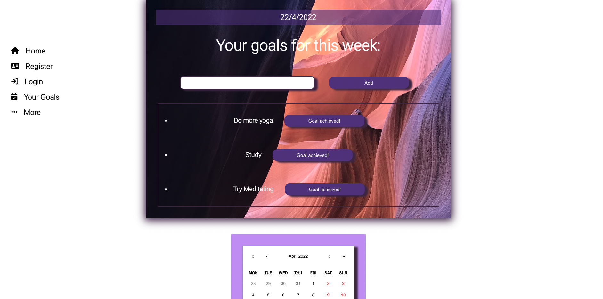
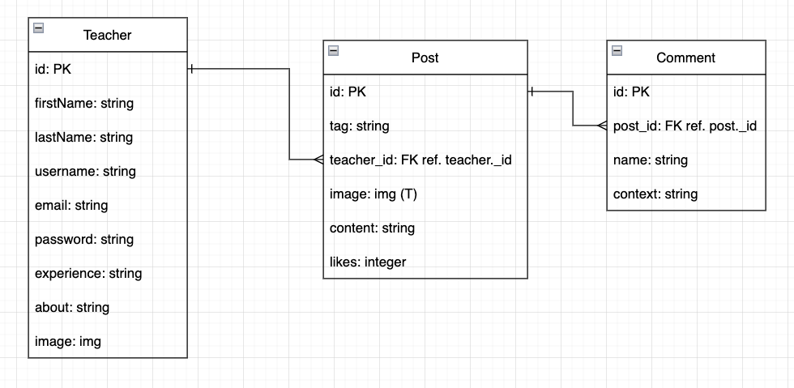

# Mindify (Back End)

***********
### Creators: Magdalena Joseph, Ran Kim, Ifeoluwa Adebisi, Chaz Curlee
************

## Description:
Mindify is a one stop shop for all your mental, emotional, and physical needs. Experienced teachers provide great lessons, recipes, and advice via posts. Any student can comment and like these posts.

******
## Technologies Used:

- Postgres
    

- Express
    

- React.js
    

- Node.js
    

****
## Getting Started:
- Fork and Clone Repo

- npm i for both the frontend and backend directories

- npm start in backend server before npm start frontend

- [Trello Board](https://trello.com/b/7b1J7R2G/mindify)

 

******
## Future Updates:

[] - Questions Page Incorporated

[] - Stylizing Frontend Further

*****
## Social Links:
 - Magdalanea Joseph: [Linkedin](https://www.linkedin.com/in/magdalena-joseph8/) - [Github](https://github.com/MagJoseph)

 - Ran Kim: - [Linkedin](https://www.linkedin.com/in/rankim/) - [Github](https://github.com/rannkimm)

 - Ifeoluwa Adebisi: [Linkedin](https://www.linkedin.com/in/ifeoluwa-adebisi-b6a9911b7/) - [Github](https://github.com/SEIfeoluwa)

 - Chaz Curlee: [Linkedin](https://www.linkedin.com/in/magdalena-joseph8/) - [Github](https://github.com/chazcurlee)

 ******
 ## Credits:

 - GA Past Lessons/Labs Repos

 - Ben Manning and Nabila Ayaba